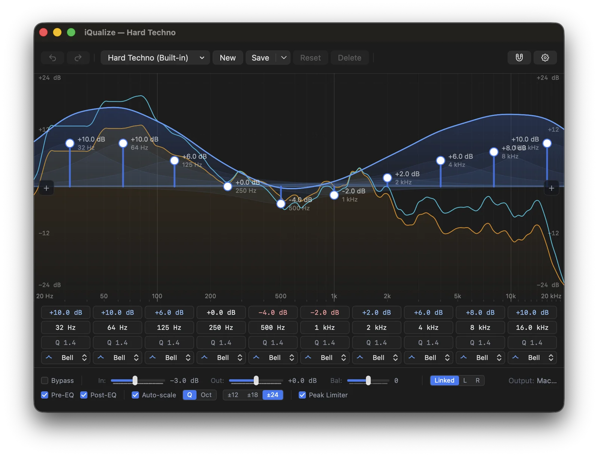

# iQualize

> macOS doesn't have a system-wide parametric EQ.
> So I built one in a day.



Built at 04:57 in Bavaria, listening to [Opera by Ballarak](https://open.spotify.com/track/6EkjiVchNqlYHoc2YNMiaV) on a Teufel Concept E 5.1.
That's the only explanation you need for why this exists.

---

## What it is

A native macOS system-wide parametric EQ with a real-time Pre/Post spectrum analyzer.
No virtual audio drivers. No Electron. No paywall.
Just Swift, CoreAudio, and a CATap doing what they should've always done.

## Why not eqMac

eqMac uses a virtual audio driver.
iQualize uses a CATap — Apple's native system audio tap introduced in macOS 14.
No driver to install. No driver to break. No driver to fight with Bluetooth.
It just works.

## Requirements

- macOS 14.2+ (Core Audio Taps API)
- Screen & System Audio Recording permission

## Install

### Download (recommended)

Grab the latest `.dmg` from [Releases](https://github.com/DariusCorvus/iqualize/releases), open it, and drag iQualize to Applications.

iQualize is unsigned. Apple charges $99/year for a developer certificate. If macOS blocks the app, run:

```bash
xattr -dr com.apple.quarantine /Applications/iQualize.app
```

### Build from source

```bash
bash install.sh          # builds, signs, installs to /Applications
open /Applications/iQualize.app
```

## Features

### Parametric EQ

- Up to 31 bands with editable frequency (20 Hz – 20 kHz), gain, and bandwidth
- Q / Octave display toggle — switch between Q factor and octave bandwidth globally (Q is the default, octaves for musicians who think in bandwidth)
- 7 filter types per band: Bell (parametric), Low Shelf, High Shelf, Low Pass, High Pass, Band Pass, and Notch
- Accurate biquad frequency response curve using Audio EQ Cookbook formulas, rendered as a translucent backdrop behind EQ sliders
- Per-band ghost fills, anchor dots with dB labels, and split boost/cut composite fill
- Axis labels and detailed frequency/dB grid overlay
- Catmull-Rom spline interpolation connecting slider knob positions (dashed gray line)
- Adjustable max gain range: ±6, ±12, ±18, or ±24 dB — or auto-scale to fit the current curve (up to ±24 dB)
- Input gain (±24 dB) — pre-EQ level control for proper gain staging
- Output gain (±24 dB) — post-EQ level control, applied before the peak limiter
- Dynamic peak limiter (AUPeakLimiter) — prevents digital clipping at 0 dBFS
- Smooth, glitch-free parameter updates — only changed values are written to the audio unit

### Band Management

- Add bands with + buttons on either side of the EQ — new band copies the leftmost or rightmost band
- Right-click context menu: Add Suggested Band finds the largest frequency gap and inserts a new band at the geometric midpoint
- Delete, or reorder via the right-click context menu (Move Left/Right)
- Minimum 1 band, maximum 31

### Presets

- Built-in presets: Flat, Bass Boost, Vocal Clarity, Loudness, Treble Boost, Podcast, Techno, Deep House, Hard Techno, Minimal, American Rap, German Rap
- Create, rename, overwrite, and delete custom presets
- Built-in presets auto-fork when edited (non-destructive)
- Unsaved changes indicator (asterisk in title)
- Import/export as `.iqpreset` JSON files with batch import and overwrite protection
- Quick switching from the menu bar or EQ window picker

#### Preset Format

Presets are `.iqpreset` files — plain JSON:

```json
{
  "bands": [
    { "bandwidth": 1.0, "filterType": "parametric", "frequency": 80, "gain": 5 },
    { "bandwidth": 1.2, "filterType": "lowShelf", "frequency": 200, "gain": -3 }
  ],
  "id": "CDE9BB8A-12A5-420C-9619-2790E20030D5",
  "isBuiltIn": false,
  "name": "My Preset"
}
```

Each band: `frequency` (Hz, 20–20000), `gain` (dB), `bandwidth` (octaves, 0.05–10 — 1.0 = one octave ≈ Q 1.41), `filterType` (one of `parametric`, `lowShelf`, `highShelf`, `lowPass`, `highPass`, `bandPass`, `notch` — defaults to `parametric` if omitted).

### Undo/Redo

- Full undo/redo for all EQ modifications (gain, frequency, bandwidth, reorder, add, delete)
- Slider drags coalesced into single undo actions
- Cmd+Z / Cmd+Shift+Z

### Keyboard & Scroll

- Click a band or drag its slider to select it (accent-colored border indicator)
- Arrow Up/Down to adjust gain (±0.5 dB per step)
- Arrow Left/Right to adjust frequency (semitone steps)
- Tab / Shift+Tab to cycle between bands
- Scroll wheel over sliders to adjust gain
- Scroll wheel over frequency/Q inputs to adjust those values
- Cmd+B — toggle Bypass EQ (works from the EQ window or menu bar)
- Cmd+, — open Settings
- Rapid adjustments coalesced into single undo entries

### Menu Bar

- Open iQualize — first item in the menu for quick access
- Option+click the menu bar icon to open the EQ window directly (skips the menu)
- Presets submenu with checkmarks and active preset name in parent item — changes sync to the EQ window in real time
- Bypass EQ toggle (Cmd+B) — pass audio through unprocessed; while bypassed, the Post-EQ spectrum line and its color/fill controls are hidden/disabled (post-EQ would otherwise just mirror pre-EQ)
- Current output device display
- Help… (Cmd+?) — opens an in-app Help window rendering the README's Features section, with a "View latest on GitHub" link
- About iQualize — shows version and a "View on GitHub" button that opens the project page in your default browser

### Settings

Accessible via the gear icon in the EQ window, the Settings item in the menu bar, or Cmd+,.

- **Audio**: Peak Limiter toggle, Max Gain range (±6/12/18/24 dB), Auto Scale toggle
- **Display**: Pre-EQ / Post-EQ spectrum toggles, per-spectrum line color picker, per-spectrum Fill toggle with its own color picker, reset buttons to return to the dynamic system colors, Q / Octave bandwidth display toggle
- **General**: Theme (Auto / Light / Dark), Hide from Dock toggle, Start at Login toggle

### Spectrum Analyzer

- Dual real-time spectrum analyzer: pre-EQ (raw input) and post-EQ (processed output)
- Independent toggle checkboxes for pre-EQ and post-EQ display
- 2048-point FFT via Accelerate vDSP with Hann windowing and log-frequency binning
- Smooth Catmull-Rom spline rendering with peak hold lines
- Lock-free double-buffered audio-to-UI transfer for glitch-free 60fps updates
- Customizable line and fill colors per spectrum (Settings → Display) — defaults to cyan for pre-EQ, orange for post-EQ, both adapting to Light and Dark appearance; reset returns to the dynamic system color
- Per-spectrum fill toggle (off by default for pre-EQ, on for post-EQ) with its own color, independent from the line color
- Post-EQ spectrum auto-hides when EQ bypass is active (post-EQ would otherwise just mirror pre-EQ)
- Spectrum toggle states, fill toggles, and color choices persist across app restarts

### Stereo Balance

- L/R balance slider in the bottom bar, centered by default
- Snap-to-center with double-click reset
- Applied as per-channel gain in the audio render callback

### System Integration

- Automatic output device switching and reconnection
- Sleep/wake handling — pauses on sleep, resumes on wake
- Window state and all settings persist across launches
- Codesigned for stable TCC permissions across rebuilds
- Built with Swift Package Manager — no Xcode project needed

## Architecture

> For the long version — why CATap, what fought back, and how the audio graph came together — read the blog post: [Building iQualize - A System-Wide EQ That Doesn't Suck](https://darius.codes/writing/building-iqualize).

iQualize uses Core Audio Taps (CATap), introduced in macOS 14.2, to intercept system audio without a virtual audio device. Virtual devices (like BlackHole or eqMac's driver approach) create a secondary audio path — you lose system volume control, break some DRM-protected audio, and add latency. CATap captures the audio stream directly from the HAL, processes it in-process, and sends it to the output device.

```
┌─────────────────────────────────────────────────┐
│  macOS Audio Server                             │
│                                                 │
│  App Audio ──┬── Output Device (muted by tap)   │
│              │                                  │
│              └── CATap ──► iQualize IOProc      │
│                            │                    │
│                            ▼                    │
│                       Ring Buffer               │
│                            │                    │
│                            ▼                    │
│                   AVAudioSourceNode             │
│                            │                    │
│                            ▼                    │
│                    AVAudioUnitEQ                 │
│                    (parametric EQ)               │
│                            │                    │
│                            ▼                    │
│                    Output Gain Node              │
│                    (AVAudioUnitEQ, 0 bands)      │
│                            │                    │
│                            ▼                    │
│                    AUPeakLimiter                  │
│                            │                    │
│                            ▼                    │
│                    Output Device                 │
└─────────────────────────────────────────────────┘
```

The ring buffer decouples the real-time IOProc callback from AVAudioEngine's pull model. Parameter changes are written atomically — no locks in the audio thread, no glitches on slider drags.

## Output Handling

iQualize detects the output device's sample rate and converts internally so the audio plays back correctly regardless of what device you're on. Bluetooth sends stereo (2ch) only — SBC, AAC, and aptX all max out at 2 channels. If your speaker system supports 5.1 (e.g. Teufel Concept E via USB), the hardware handles channel routing and upmixing (Dolby Pro Logic II etc) on its end.

---

I build tools that shouldn't need to exist.

[darius.codes](https://darius.codes)
